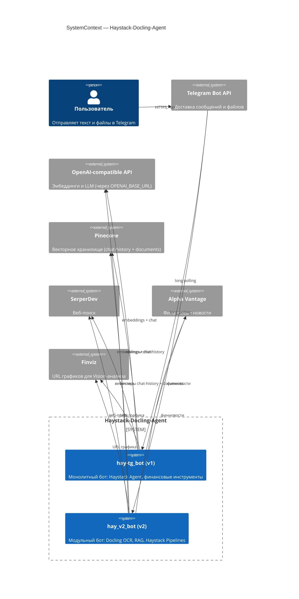
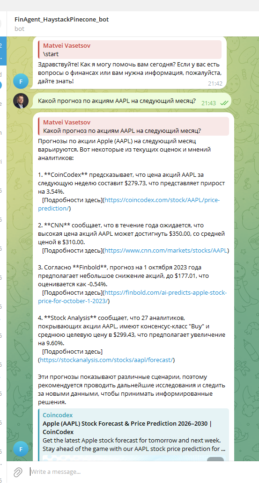
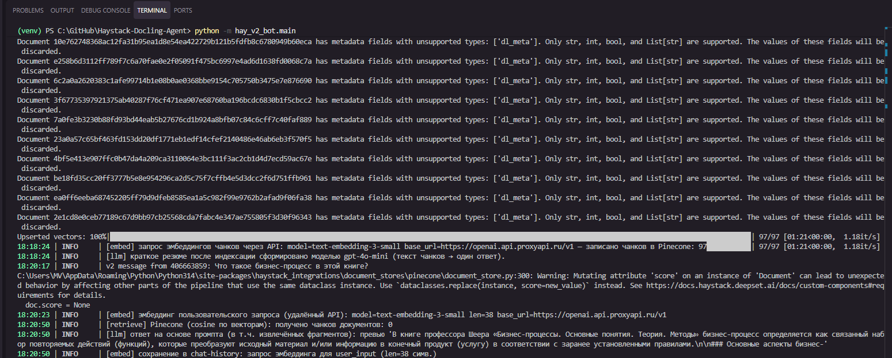
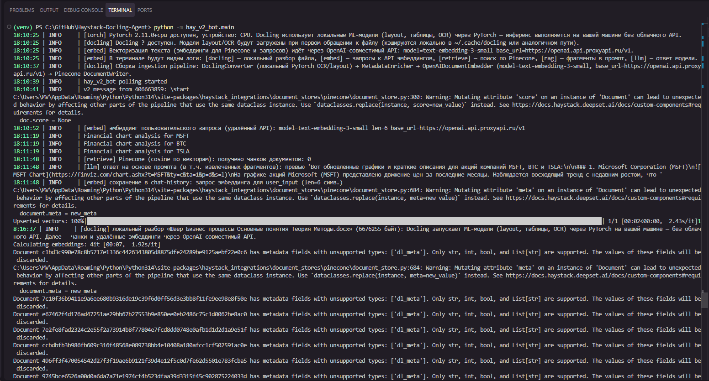
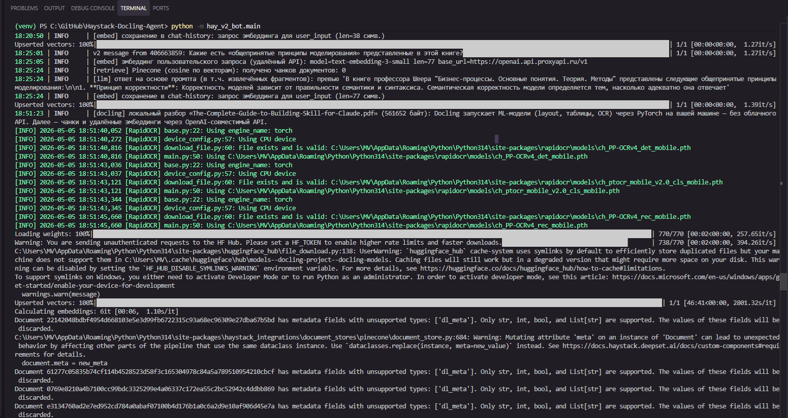

# Haystack-Docling-Agent — Финансовый Telegram-бот

Финансовый ассистент на базе **Haystack 2.x** с долговременной памятью в **Pinecone** и интерфейсом через **Telegram**. Проект содержит две версии бота: монолитную v1 и модульную v2 с поддержкой загрузки документов через **Docling** (локальный OCR на PyTorch).

## Версии бота

| | v1 `hay/hay-tg_bot.py` | v2 `hay_v2_bot/` |
|---|---|---|
| Архитектура | один файл | модули `components/`, `pipelines/`, `bot/` |
| Загрузка документов | нет | PDF, DOCX, PPTX, XLSX, HTML, Markdown (Docling) |
| OCR / layout | нет | локально через PyTorch + Docling |
| RAG по документам | нет | Haystack Pipeline: retriever → prompt → agent |
| Ответ агента | прямой `Agent.run` | `Pipeline` + `AnswerBuilder` |
| Память | Pinecone `chat-history` | Pinecone `chat-history` + `documents` |
| Эмбеддинги | OpenAI через ProxyAPI | то же самое |

Обе версии используют один `.env` и один Pinecone-индекс (разные namespace). Можно запускать параллельно с разными `TELEGRAM_BOT_TOKEN`.

## Возможности

- **RAG по загруженным файлам** (v2): Docling разбирает документ локально → чанки индексируются в Pinecone → LLM отвечает на вопросы по тексту.
- **Финансовые факты**: актуальные новости через Alpha Vantage API.
- **Анализ графиков**: автоматическое получение графика с Finviz и анализ через OpenAI Vision (GPT-4o). Поддерживает запросы вида «Покажи график TSLA».
- **Веб-поиск**: SerperDev (Google) для актуальной информации.
- **Долговременная память**: история диалога в Pinecone, фильтрация по `user_id`.
- **Резюме документа** (v2): после индексации бот отправляет одно предложение-резюме (map-reduce через LLM).
- **Команда `/clear`** (v2): удаление истории и документов пользователя из Pinecone.
- **Логирование**: Loguru с префиксами `[torch]`, `[docling]`, `[embed]`, `[retrieve]`, `[rag]`, `[llm]`.

## Структура проекта

```
Haystack-Docling-Agent/
├── hay/
│   └── hay-tg_bot.py          # v1: монолитный бот (Haystack Agent)
├── hay_v2_bot/                 # v2: модульный бот
│   ├── bot/
│   │   └── telegram_bot.py    # обработчики Telegram
│   ├── components/
│   │   ├── context.py         # Pinecone stores + история
│   │   └── tools.py           # инструменты агента, MetadataEnricher, суммаризация
│   ├── pipelines/
│   │   ├── ingestion_pipeline.py   # Docling → embed → Pinecone
│   │   └── generation_pipeline.py  # embed query → retrieve → agent → answer
│   ├── config.py              # Settings из .env
│   ├── main.py                # точка входа
│   ├── README.md              # документация v2
│   └── ARCHITECTURE.md        # C4 и UML диаграммы
├── bot.py                     # простой бот без Haystack (прототип)
├── pinecone_manager.py        # утилита управления Pinecone-индексом
├── requirements.txt
├── .env                       # переменные окружения (не коммитить)
└── logs/
    ├── app.log
    └── tools.log
```

## Настройка

Создайте файл `.env` в корне репозитория:

```env
# Pinecone
PINECONE_API_KEY=ваш_ключ
PINECONE_INDEX_NAME=haystack-agent   # размерность индекса: 1536

# OpenAI / ProxyAPI
PROXY_API_KEY=ваш_ключ
OPENAI_BASE_URL=https://api.proxyapi.ru/openai/v1
EMBEDDING_MODEL=text-embedding-3-small
CHAT_MODEL=gpt-4o-mini

# Telegram
TELEGRAM_BOT_TOKEN=токен_от_BotFather

# Внешние API
ALPHAVANTAGE_API_KEY=ваш_ключ_или_demo
SERPERDEV_API_KEY=ваш_ключ
```

Опционально для v2: `VECTOR_DIMENSION` (по умолчанию `1536`), `RAG_TOP_K` (по умолчанию `5`), `SUMMARY_BATCH_MAX_CHARS` (по умолчанию `12000`).

## Установка зависимостей

```bash
pip install -r requirements.txt
```

> **Примечание о venv:** пакеты `torch`, `docling` и `transformers` тяжёлые. Если используете `venv`, создайте его с флагом `--system-site-packages`, чтобы не дублировать уже установленные пакеты:
> ```bash
> python -m venv --system-site-packages venv
> ```

## Запуск

### v2 (рекомендуется)

```bash
# Windows
.\venv\Scripts\activate
python -m hay_v2_bot.main

# Linux / macOS
source venv/bin/activate
python -m hay_v2_bot.main
```

### v1

```bash
python hay/hay-tg_bot.py
```

Логи пишутся в `logs/app.log` и `logs/tools.log`.

## Локальная обработка документов (v2)

Разбор загруженного файла выполняется **полностью локально** — без облачного OCR API:

- **DoclingConverter** запускает ML-модели layout, таблиц и OCR через **PyTorch** (CPU или GPU)
- Модели кэшируются в `~/.cache/docling/` при первом запуске
- Чанкование — `HybridChunker` с `tiktoken` (только подсчёт токенов, без локального эмбеддинга)
- Эмбеддинги чанков и запросов — через OpenAI-совместимый API (`OPENAI_BASE_URL`)

**Логи в терминале при работе v2:**

```
[torch]    PyTorch 2.x.x доступен, устройство: CPU
[docling]  локальный разбор «report.pdf» (2048000 байт): Docling запускает ML-модели...
[embed]    запрос эмбеддингов чанков через API: model=text-embedding-3-small — записано чанков: 42
[embed]    эмбеддинг пользовательского запроса: model=text-embedding-3-small len=156
[retrieve] Pinecone (cosine по векторам): получено чанков документов: 5
[rag]      фрагмент #0 в промпт: file=report.pdf page=3 chunk=12 | "Текст фрагмента..."
[llm]      ответ на основе промпта: превью "Ответ модели..."
```

## Архитектура (C4 System Context)



Подробные диаграммы C4 Container и UML Sequence — в [hay_v2_bot/ARCHITECTURE.md](hay_v2_bot/ARCHITECTURE.md).

## Логирование

Логи сохраняются в `logs/`:
- `app.log` — общие логи приложения (ротация 500 МБ)
- `tools.log` — детальные логи работы инструментов агента

## Скриншоты

### v1 — hay-tg_bot

| Telegram-бот | Финансовый прогноз | Pinecone Index |
|:---:|:---:|:---:|
|  |  |  |

| Терминал (запуск) | Терминал (работа) |
|:---:|:---:|
|  |  |

### v2 — hay_v2_bot (Docling + RAG)

#### Telegram — загрузка файлов и ответы

| Загрузка PDF | Резюме документа | Вопрос по документу |
|:---:|:---:|:---:|
|  |  |  |

| Загрузка книги (Шеер) | Вопрос об аукционе | Вопрос о Skill for Claude |
|:---:|:---:|:---:|
|  |  |  |

#### Терминал — этапы обработки

| Загрузка и OCR | Резюме в терминале | Ответы бота |
|:---:|:---:|:---:|
|  |  |  |

| Старт бота | OCR PDF | Pinecone (индекс) |
|:---:|:---:|:---:|
|  |  |  |
