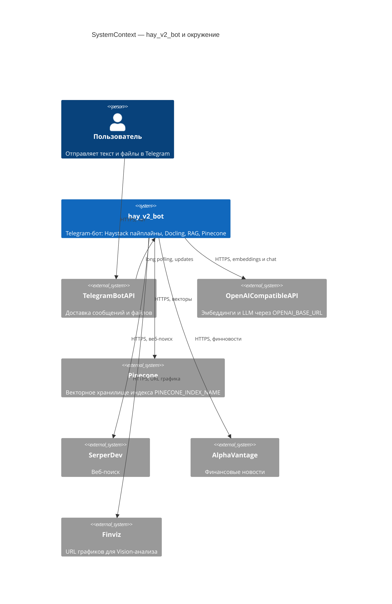
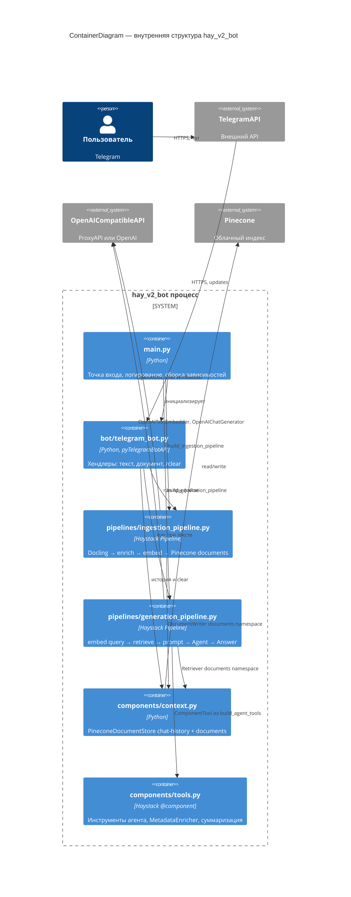
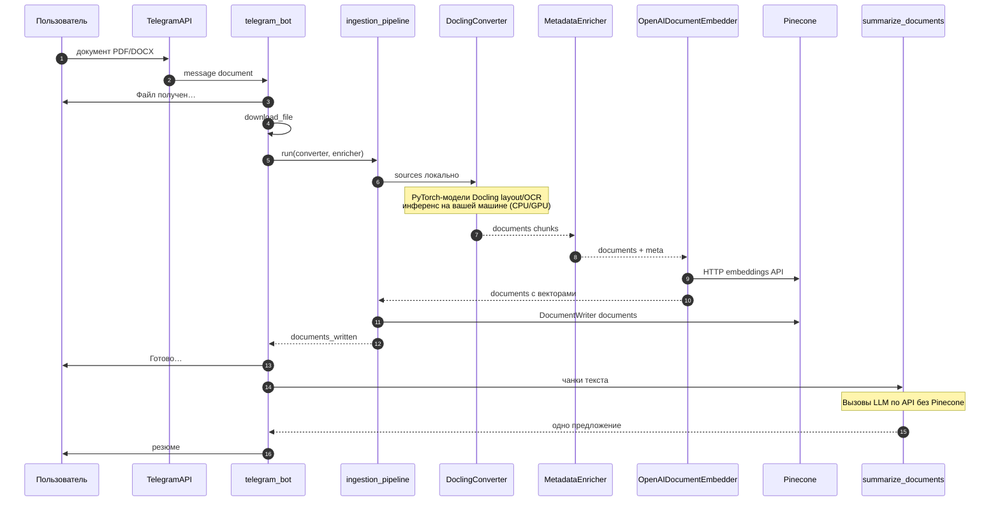
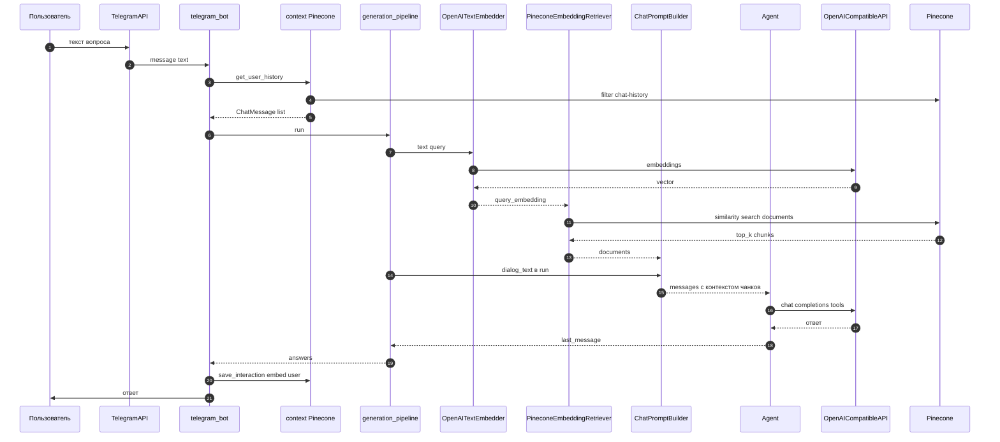
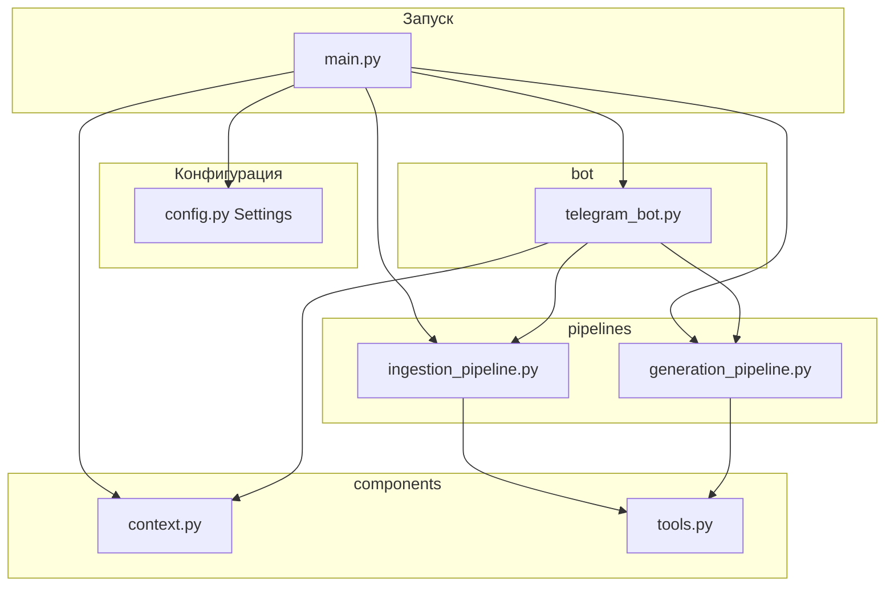
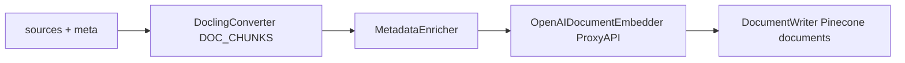
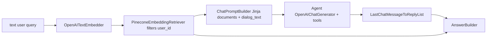

# Архитектура hay_v2_bot

## Диаграммы C4 и UML (Mermaid)

Ниже — нотации **C4** (контекст и контейнеры) и **UML** (диаграммы последовательностей) для `hay_v2_bot`. Рендер: GitHub, VS Code с Mermaid, многие статические генераторы документации.

### C4: контекст системы (System Context)

Показывает `hay_v2_bot` среди внешних систем и пользователя.



### C4: контейнеры внутри hay_v2_bot (Container)

Логические части приложения (каталоги и пайплайны), граница системы — один процесс Python.



### UML: последовательность — загрузка файла, индексация, резюме



### UML: последовательность — текстовый вопрос с RAG



### UML: компоненты модулей (упрощённый component view)



## Роль Haystack Pipeline

**Pipeline** в Haystack 2 — это ориентированный граф компонентов (`@component`). У каждого компонента есть метод `run()` с именованными входами и выходами. `pipeline.connect("A.out", "B.in")` связывает выход одного шага с входом следующего. Вызов `pipeline.run({...})` передаёт внешние входы (например, текст запроса или фильтры) и исполняет компоненты в топологическом порядке.

Преимущества: явный поток данных, повторное использование компонентов, проще логировать и тестировать отдельные шаги.

## Pinecone: два namespace в одном индексе

- `chat-history` — фрагменты диалога (эмбеддинг по тексту пользователя, метаданные `user_id`, `user_input`, `assistant_output`).
- `documents` — чанки из Docling (эмбеддинг контента чанка, метаданные `user_id`, `filename`, `chunk_index`, `page_no`, `dl_meta`).

Retriever в generation-пайплайне читает **только** `documents` с фильтром по `user_id`, чтобы пользователь не видел чужие файлы.

## Ingestion pipeline



- **DoclingConverter** (`docling-haystack`): парсит файл/URL в структуру Docling и при `ExportType.DOC_CHUNKS` нарезает на осмысленные чанки. Чанкер — `HybridChunker` с **`OpenAITokenizer` + `tiktoken`**: это только подсчёт токенов для лимита размера чанка, **без локального эмбеддинга**.
- **MetadataEnricher**: добавляет `filename`, `chunk_index`, `page_no` (если удаётся извлечь из `dl_meta` через `DocChunk`), `user_id`.
- **OpenAIDocumentEmbedder**: векторизация через ваш `OPENAI_BASE_URL` и `text-embedding-3-small`.
- **DocumentWriter**: запись в `PineconeDocumentStore` (namespace `documents`, политика overwrite).

Импорт `DoclingConverter` выполняется внутри `build_ingestion_pipeline()` и поддерживает оба распространённых пути пакета: `haystack_integrations...` и `docling_haystack...`.

## Generation pipeline



- **OpenAITextEmbedder**: эмбеддинг последнего пользовательского сообщения для семантического поиска по чанкам.
- **PineconeEmbeddingRetriever**: `query_embedding` + `filters` по `user_id`.
- **ChatPromptBuilder**: одно пользовательское сообщение-шаблон с Jinja: вставляет найденные `documents` и строку `dialog_text` (история + текущий запрос в текстовом виде).
- **Agent**: те же три инструмента, что в v1 (Alpha Vantage, Finviz+Vision, SerperDev). `exit_conditions=["text"]`, ограничение шагов.
- **LastChatMessageToReplyList**: берёт стандартный выход агента `last_message` и превращает его в `replies` (список строк) для AnswerBuilder.
- **AnswerBuilder**: собирает `GeneratedAnswer` с текстом и привязкой к документам-источникам.

## Поток в Telegram

1. **Текст**: `get_user_history` → список `ChatMessage` → `dialog_text` → `generation_pipeline.run(...)`. Ответ берётся из `answer_builder.answers[0]` (с запасным вариантом по `agent.messages`). Специальный случай JSON от инструмента графика — как в v1 (фото + caption).
2. **Файл**: скачивание во временную папку → `ingestion_pipeline.run` с `sources` и `meta` → очистка temp → сообщение «Готово…» → `summarize_documents` по чанкам из выхода `doc_embedder` (или `metadata_enricher`), с map-reduce при большом объёме текста.

### Логи в терминале

Все ключевые этапы обработки логируются с префиксами, что позволяет видеть обращения к векторным вложениям в реальном времени:

| Префикс | Этап | Где выполняется |
|---------|------|-----------------|
| `[torch]` | Проверка PyTorch и GPU при старте | Локально |
| `[docling]` | Разбор файла: layout, таблицы, OCR | Локально (PyTorch) |
| `[embed]` | Запрос эмбеддингов чанков или запроса | Удалённо (OpenAI API) |
| `[retrieve]` | Поиск по векторам в Pinecone | Удалённо (Pinecone) |
| `[rag]` | Фрагменты документов в промпт | Локально (логирование) |
| `[llm]` | Ответ языковой модели | Удалённо (OpenAI API) |

## Зависимости Docling и модели

### Локальный инференс через PyTorch

Docling для разбора PDF/DOCX подтягивает **свои** модели распознавания layout/таблиц/OCR и выполняет инференс **локально** через **PyTorch**. Это не облачный «Docling API»: конвертация идёт на вашей машине.

**Компоненты локальной обработки:**
- `docling-ibm-models` — веса моделей layout и таблиц (загружаются при первом запуске в `~/.cache/docling/`)
- `easyocr` или встроенный OCR Docling — распознавание текста на изображениях
- `PyTorch` — фреймворк для инференса всех ML-моделей
- `HybridChunker` + `tiktoken` — нарезка на чанки (только подсчёт токенов, без локального эмбеддинга)

**При старте бота в терминале:**
```
[torch] PyTorch 2.x.x доступен, устройство: CPU
[docling] Docling доступен. Модели layout/OCR будут загружены при первом обращении к файлу
```

**При загрузке файла:**
```
[docling] локальный разбор «report.pdf» (2048000 байт): Docling запускает ML-модели
          (layout, таблицы, OCR) через PyTorch на вашей машине — без облачного API.
```

### Векторные эмбеддинги (удалённый API)

**Эмбеддинги для Pinecone** в этом проекте считаются **не** локальным PyTorch, а запросами к **OpenAI-совместимому** эндпоинту (`OpenAIDocumentEmbedder` / `OpenAITextEmbedder` через `OPENAI_BASE_URL`, например ProxyAPI).

**В терминале видны все обращения к векторным вложениям:**
```
[embed] запрос эмбеддингов чанков через API: model=text-embedding-3-small base_url=https://... — записано чанков в Pinecone: 42
[embed] эмбеддинг пользовательского запроса (удалённый API): model=text-embedding-3-small len=156
[embed] сохранение в chat-history: запрос эмбеддинга для user_input (len=156 симв.)
[retrieve] Pinecone (cosine по векторам): получено чанков документов: 5
[rag] фрагмент #0 в промпт: file=report.pdf page=3 chunk=12 | "Текст фрагмента..."
[llm] ответ на основе промпта (в т.ч. извлечённых фрагментов): превью "Ответ модели..."
```

Чат-память в namespace `chat-history` при сохранении тоже вызывает эмбеддинг пользовательской реплики через тот же API.

## Файлы

| Файл | Назначение |
|------|------------|
| [config.py](config.py) | `Settings`, константы namespace |
| [components/context.py](components/context.py) | Инициализация Pinecone + история |
| [components/tools.py](components/tools.py) | Инструменты, `MetadataEnricher`, суммаризация, мост к AnswerBuilder |
| [pipelines/ingestion_pipeline.py](pipelines/ingestion_pipeline.py) | Сборка ingestion Pipeline |
| [pipelines/generation_pipeline.py](pipelines/generation_pipeline.py) | Сборка generation Pipeline |
| [bot/telegram_bot.py](bot/telegram_bot.py) | Обработчики Telegram |
| [main.py](main.py) | Точка входа |
